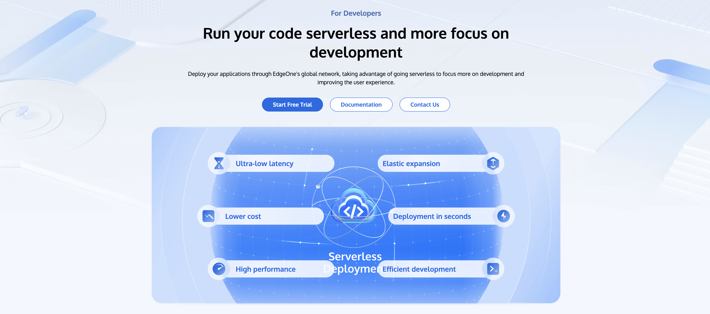

<h1 align="center">Tencent EdgeOne | <a href="https://edgeone.ai/products/function" rel="nofollow">Edge Functions</a></h1></h1>

  <b> 🚀 Fast | 🔑 Secure | ☁️ Serverless | 💫 Innovative</b>

  EdgeOne Edge Functions is a serverless compute platform that allows you to run JavaScript code at the edge, close to your users. This repository contains examples demonstrating various use cases and capabilities of EdgeOne Edge Functions.

  <a href="#features">Features</a> •
  <a href="#get-started">Get Started</a> •
  <a href="#documentation">Documentation</a> •
  <a href="#examples">Examples</a> •
  <a href="#contribute">Contribute</a> •
  <a href="#license">License</a>

---

  <kbd></kbd>

## Features

### 🚀 Lightning Fast Acceleration

- 3200+ Global CDN PoP
- 200Tbps Global Network Bandwidth
- 100+ Custom CDN Abilities
- L4/L7 Intelligent Acceleration

### 🛡️ Dependable Protection

- 15 Tbps Global Bandwidth for DDoS Mitigation
- 3 Seconds Time-To-Mitigation Against DDoS Attacks
- 20+ Customizable Security Features
- Minute-level Data Statistical Analysis

### 💻 Extremely Flexible Serverless

- Programmable in Edge
- Adaptive images in Edge
- Application in Edge

### 🎥 Advanced Media Experience

- 99.5% Upload Success Rate
- 89% Bitrate Reduced
- <1s Transcoding Time

## Get Started

Detailed instructions can be found in our  [Getting Started](https://edgeone.ai/document/53373?product=edgedeveloperplatform).

## Examples

This repository contains various examples demonstrating the capabilities of EdgeOne Edge Functions. Each example is contained in its own directory with a README explaining its purpose and usage.

Some of the examples include:

- [Aggregate Requests](./aggregate-requests)
- [Adaptive WebP Images](./adaptive-webp)
- [Caching POST Requests](./cache-post-request)
- [Obtain Client Geo Info](./geolocation-info)

Feel free to explore these examples and use them as a starting point for your own Edge Functions!

For more examples, see [Examples](https://edgeone.ai/developer/examples).

## Documentation

Detailed documentation can be found in our [Documentation](https://edgeone.ai/document/53372).

---
