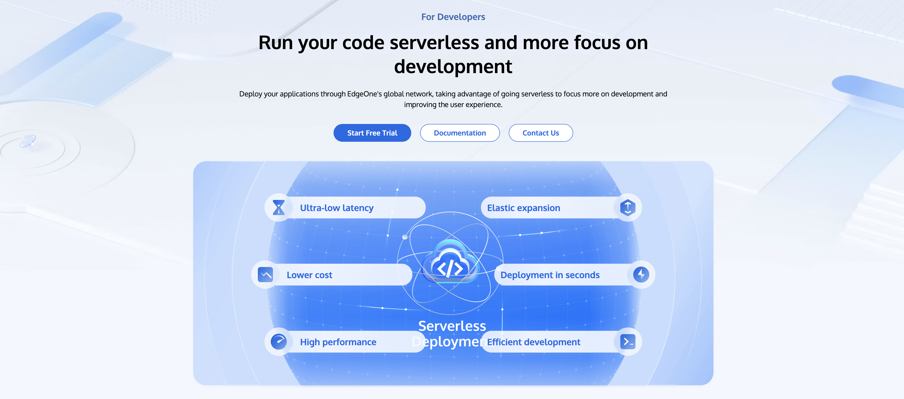

  Language:
  <a title="English" href="./README.md">English</a>
  <a title="中文" href="#readme-cn">中文</a>

---

<h1 align="center">腾讯 EdgeOne | <a href="https://edgeone.ai/products/function" rel="nofollow">边缘函数</a></h1>

  <b> 🚀 快速 | 🔑 安全 | ☁️ 无服务器 | 💫 创新</b>

  EdgeOne 边缘函数是一个无服务器计算平台，允许您在靠近用户的边缘运行 JavaScript 代码。本仓库包含演示 EdgeOne 边缘函数各种用例和功能的示例。

  <a href="#功能特性">功能特性</a> •
  <a href="#快速开始">快速开始</a> •
  <a href="#文档">文档</a> •
  <a href="#示例">示例</a> •
  <a href="#贡献">贡献</a> •
  <a href="#许可证">许可证</a>

---

  <kbd></kbd>

## 功能特性

### 🚀 闪电般的加速

- 3200+ 全球 CDN 节点
- 200Tbps 全球网络带宽
- 100+ 自定义 CDN 功能
- L4/L7 智能加速

### 🛡️ 可靠的保护

- 15 Tbps 全球 DDoS 缓解带宽
- 3 秒内完成 DDoS 攻击缓解
- 20+ 可定制安全功能
- 分钟级数据统计分析

### 💻 极其灵活的无服务器

- 边缘可编程
- 边缘自适应图像
- 边缘应用

### 🎥 先进的媒体体验

- 99.5% 上传成功率
- 89% 比特率降低
- <1s 转码时间

## 快速开始

详细说明可以在我们的[入门指南](https://edgeone.ai/document/53373?product=edgedeveloperplatform)中找到。

## 示例

本仓库包含多个示例，展示了 EdgeOne 边缘函数的功能。每个示例都在自己的目录中，并附有说明其用途和使用方法的 README。

一些示例包括：

- [聚合请求](./aggregate-requests)
- [自适应 WebP 图像](./adaptive-webp)
- [缓存 POST 请求](./cache-post-request)
- [获取客户端地理信息](./geolocation-info)

欢迎探索这些示例，并将它们作为您自己的边缘函数的起点！

更多示例，请参见[示例](https://edgeone.ai/developer/examples)。

## 文档

详细文档可以在我们的[文档中心](https://edgeone.ai/document/53372)找到。

## 贡献

我们欢迎各种形式的贡献！请查看我们的贡献指南以获取更多信息。

## 许可证

本项目采用 MIT 许可证 - 有关详细信息，请参阅 LICENSE 文件。

<!--CN-END-->

---